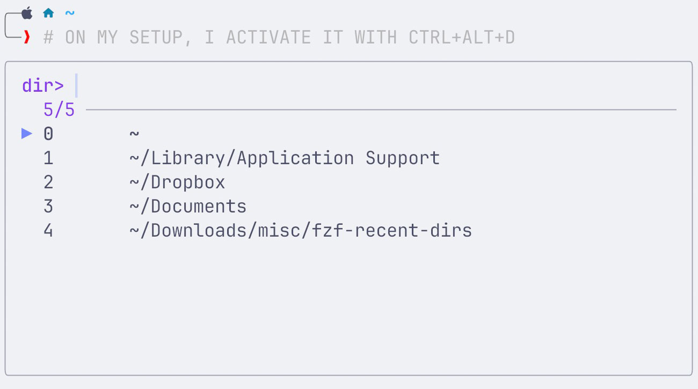

# fzf-recent-dirs

Zsh plugin that adds a single ZLE widget, `fzf-recent-dirs`, to switch to a recently visited directory using `fzf` over the directory stack (`dirs -v`).

<p align="center">
  
</p>

Features
- Lazy-loading (load time ~1ms when sourced from `~/.zshrc`)
- Compatible with oh-my-zsh, zinit, and typical plugin managers

Requirements
- Zsh
- fzf 0.38.0+ (uses `become(...)`)

## Install

### Manual

Clone this repository somewhere:

```sh
git clone https://github.com/<you>/fzf-recent-dirs.git
```

Then add to your `~/.zshrc`:

```zsh
source /path/to/fzf-recent-dirs/fzf-recent-dirs.plugin.zsh
```

### Oh My Zsh

1) Clone into your custom plugins directory:

```sh
git clone https://github.com/<you>/fzf-recent-dirs.git "$ZSH_CUSTOM/plugins/fzf-recent-dirs"
```

2) Enable it in `~/.zshrc`:

```zsh
plugins=(
  # ...
  fzf-recent-dirs
)
```

3) Restart your shell.

### Zinit

Add this to your `~/.zshrc`:

```zsh
zinit lucid wait light-mode atload"bindkey $'\e\C-d' fzf-recent-dirs" for @alberti42/fzf-recent-dirs
```

## Usage

> [!NOTE]
> Minimal footprint by design: this plugin does not install keybindings.
> This means: loading this plugin only registers the ZLE widget `fzf-recent-dirs`.
> To trigger it, you must bind a key in your `~/.zshrc` config file.

Add the following line to `~/.zshrc`:

```zsh
bindkey $'\e\C-d' fzf-recent-dirs
```

This line binds Ctrl-Alt-d (assuming your terminal sends Esc+Ctrl-d) to `fzf-recent-dirs`.
Adjust the keybinding to your preference.

To make your directory stack useful, we recommend configuring Zsh to push the
current directory onto the stack when you change directories:

```zsh
setopt AUTO_PUSHD

# Optional: if you use stack indices (e.g. `cd -1`) and prefer `-N` syntax.
setopt PUSHD_MINUS

# Optional: navigate directories without needing the "cd" command.
setopt AUTO_CD
```

## Configuration

`FRD_PRECMD_REFRESH` (default: enabled)

This plugin refreshes the prompt by running `precmd_functions` after changing directories, which is important for themes such as powerlevel10k.

To disable:

```zsh
export FRD_PRECMD_REFRESH=false
```

Set this before sourcing `fzf-recent-dirs.plugin.zsh`.

`FRD_QUIET_CD` (default: enabled)

By default the widget suppresses `cd +/-N` output on stdout so switching directories doesn't print the destination line.

To disable:

```zsh
export FRD_QUIET_CD=false
```

Set this before sourcing `fzf-recent-dirs.plugin.zsh`.

`FRD_COMPILE` (default: enabled)

When enabled, the plugin will best-effort compile its core module to `src/fzf-recent-dirs.zsh.zwc` the first time the core module is loaded. Subsequent shells will source the compiled file when it exists and is newer than the `.zsh`. This can reduce load latency.

Notes:
- Requires write permission to the plugin directory.
- If compilation fails, the plugin falls back to sourcing the `.zsh` file.

To disable (for example when the plugin directory is read-only):

```zsh
export FRD_COMPILE=false
```

Set this before sourcing `fzf-recent-dirs.plugin.zsh`.
